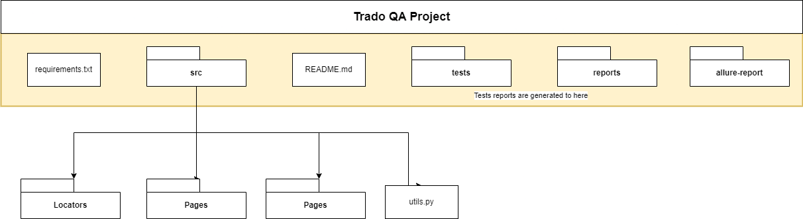

# IITC_trado_final_project
This is the final project I got from IITC, test the [Trado](https://qa.trado.co.il/) website. 
 
[Traceability Table](https://docs.google.com/spreadsheets/d/1jfXS1ULfvSClLK54Y-GzYlcyPZ_MT5OyncIkZ5uJANw/edit?usp=sharing)
<h2>Background</h2>
Trado is an e-commerce website used for suppliers and stores. Stores can buy products which are suggested by the suppliers on the site.
The suppliers are anonymous so there is no former advantage 

 
<h2>Workflow</h2>
The main objective of this project was to test the site and test processes in the website itself in any way I find it relevant.
 
I was given a list of techniques I must use and requirements and had to handle them.
 
<h4>Tools requirements:</h4>
<ul>
    <li>Selenium</li>
    <li>DB</li>
    <li>Jenkins</li>
    <li>Reporting Service (Allure)</li>
    <li>Pytest</li>
</ul>
I also received scopes to focus on:
<ul>
    <li>Homepage</li>
    <li>Contact</li> 
    <li>Footer</li>
    <li>Login & Register</li>
    <li>Product</li>
    <li>Search</li>
    <li>Personal Area</li>
    <li>Checkout Process</li>
</ul>
 
This is the project structure. At its end.

The orange frame is the main directory.  
* requirements.txt included the packages needed to run this project  
* src/locators included the locators of each page. locators_index.py is the file which holds all the locators classes.  
* src/pages includes the functions which are relevant for each page.  
* src/utils.py includes the utility and common packages for the project  
* tests directory includes all the tests  
* reports includes the reports for allure that are generated by the pytest package  
* allure-report is a folder dedicated for allure to read the reports and generate comprehensive report  

<h2> Conclusions </h2>
In total there were 51 automated tests which ran.

<table style="float:left">
<thead>
    <tr>
    <th>Result</th>
    <th>Count</th>
    </tr>
</thead>
<tr>
    <td>Success</td>
    <td>23</td>
</tr>
<tr>
    <td>Failed</td>
    <td>21</td>
</tr>
<tr>
    <td>Test Issue</td>
    <td>6</td>
</tr>
<tr>
    <td>Test Skipped</td>
    <td>1</td>
</tr>
</table>

<table style="float:left">
<thead>
    <tr>
        <th>Severity</th>
        <th>Count</th>
    </tr>
</thead>
<tr>
    <td>Critical</td>
    <td>2</td>
</tr>
<tr>
    <td>High</td>
    <td>15</td>
</tr>
<tr>
    <td>Medium</td>
    <td>14</td>
</tr>
<tr>
    <td>Low</td>
    <td>3</td>
</tr>
</table>

 
 
<h4>After wandering and testing the site I do NOT suggest to publish it due a big number of failed tests</h4>